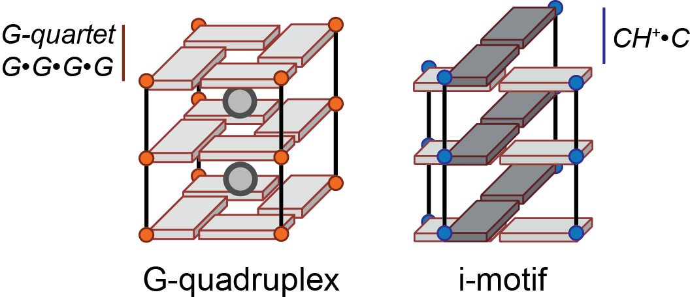
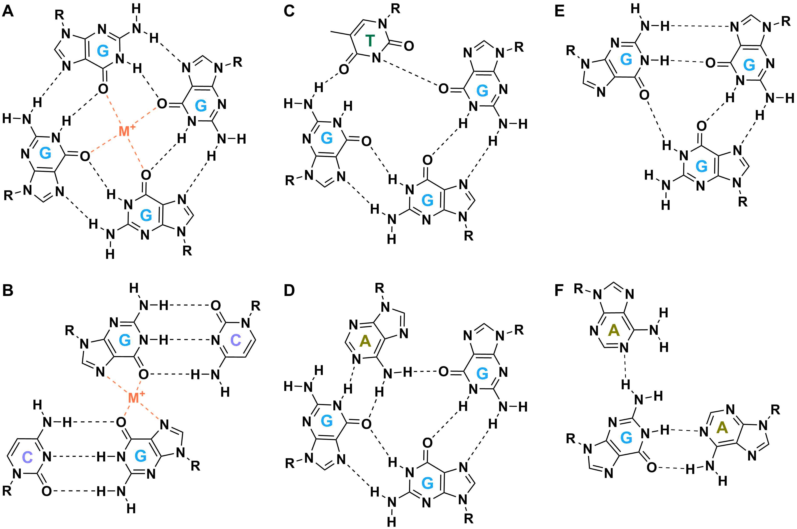
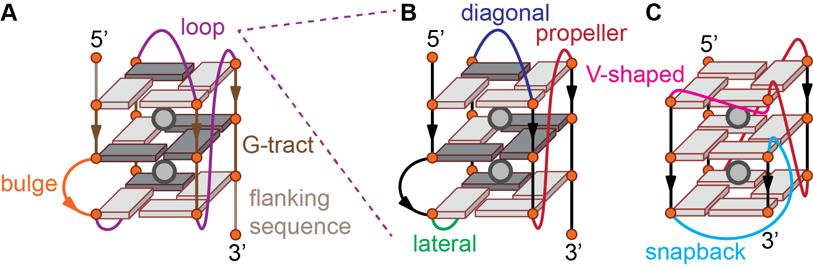
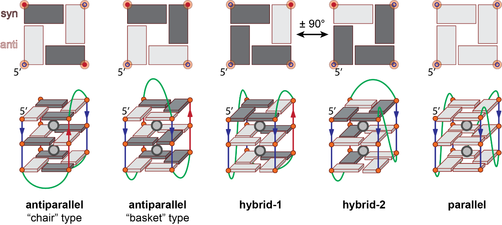
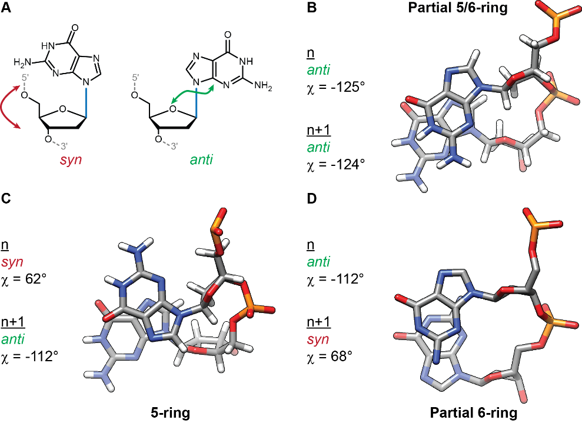
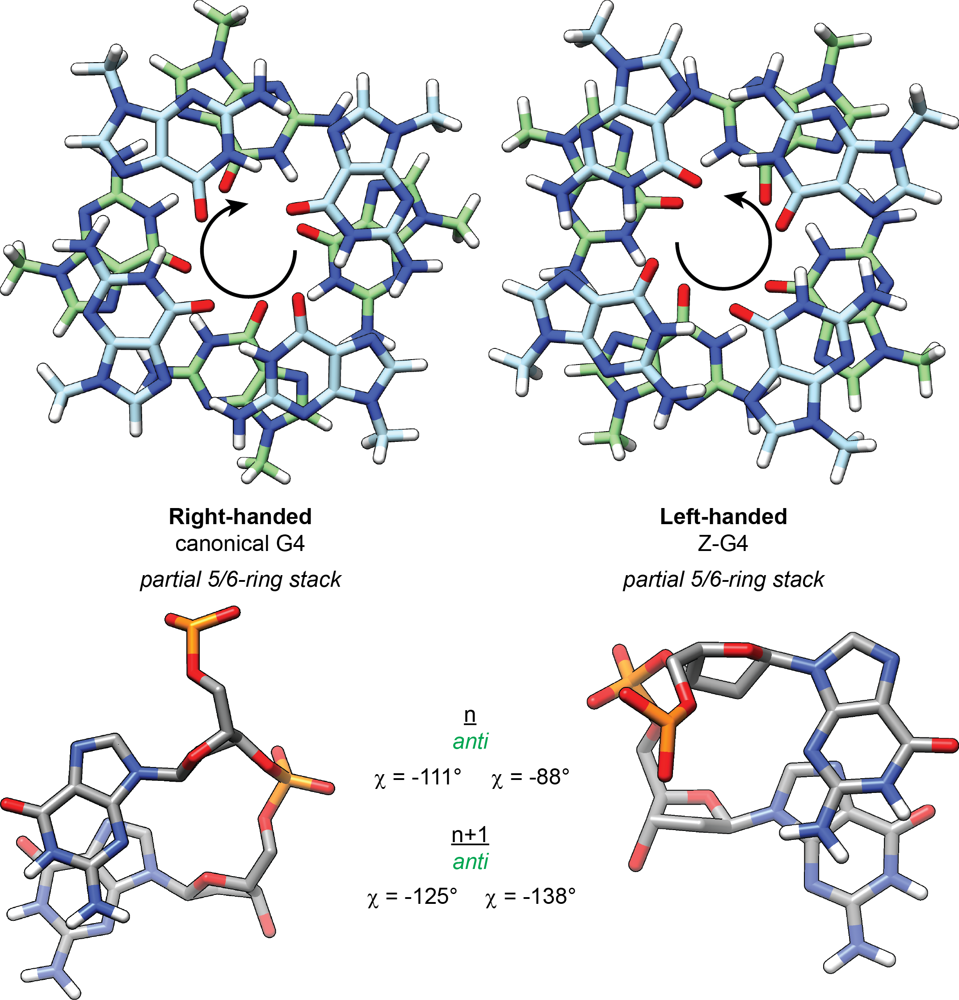
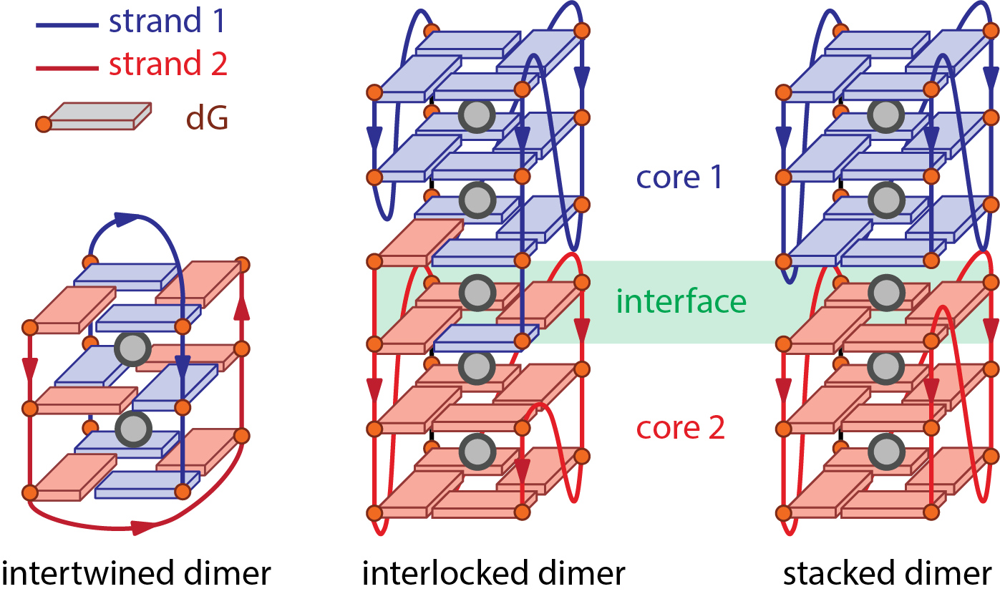

# 1. Definitions

In the following section, minimal definitions of terms specific to the field are proposed to ensure a better consistency in describing G-quadruplex structures across publications.

## 1.1. G-quadruplex

[G-quadruplex]{.ul} (abbrev.: [G4]{.ul}): Secondary structure formed by the association of a minimum of two G-quartets by $\pi$-$\pi$ stacking and coordination to a cation (Figure \@ref(fig:fig1), left). The term G-quadruplex encompasses a variety of conformations differing by their number of G-quartets, loop length and geometry, relative orientation of the G-tract strands, molecularity, and other non-canonical features (e.g. mixed quartets, extended quartets such as hexads or heptads, and additional features including triplets, base pairs or bulges). G-quadruplexes may be formed from nucleic acid having either natural (DNA, RNA) or artificial (e.g. PNA, LNA) backbones.

[Tetraplex]{.ul}: Alternative name for G-quadruplex. Not recommended to use it to avoid confusions with other uses of the word (e.g. tetraplex PCR assay). Tetraplex should not be used to imply a tetra-stranded stoichiometry; preferred wording should be: tetramolecular G-quadruplex.

```{r fig1, echo=FALSE, fig.cap="The G-quadruplex and i-motif cores. Both are formed by stacking of different building blocks, respectively the G-quartet and the hemi-protonated cytosine base pair for the i-motif. The phosphate backbone is shown as a line. Guanines and cytosines are depicted by an orange or blue circle, respectively, and a cuboid", out.width = '100%'}

```

[Z-G4]{.ul}: Left-handed G-quadruplex, named by analogy with Z-DNA left-handed double helices [@chung2015a].

[i-motifs]{.ul} (or i-DNA) are structures formed at slightly acidic pH by cytosine-rich nucleic acids, characterized by C•CH^+^ base pairs arranged in two parallel duplexes associated head-to-tail via base-pair intercalation (Figure \@ref(fig:fig1), right). Although these double duplexes can be considered as a type of quadruplex structure, they will not be discussed further herein.

## 1.2. Quartets and derivatives

[G-quartet]{.ul}: Quasi co-planar association of four guanines linked by a network of eight hydrogen bonds on both the Watson-Crick and Hoogsteen faces (i.e. N2H·N7 and N1H·O6) (Figure \@ref(fig:fig2)A). They are also frequently called [quartets]{.ul} or [tetrads]{.ul}, although these terms are less specific and should preferably be avoided.

```{r fig2, echo=FALSE, fig.cap="Chemical structures of the G-quartet (A), G·C·G·C (B [@lim2009]), G·G·G·T (C [@webbadasilva2003]) and G·G·G·A (D [@webbadasilva2003a]) mixed quartets, G·G·G G-triplet (E [@zhang2009]), and A·G·A mixed triplet (F [@zhang2009]).", out.width = '100%'}

```

[G-tract]{.ul}: Part of a nucleic sequence consisting of a minimum of two consecutive guanines, which may be involved in the formation of *G-quartets* (Figure \@ref(fig:fig3)). G-tracts involved in *G-quartet* formation can be interrupted by [bulges]{.ul} or [snapbacks]{.ul}, and linked to another G-tract by a *loop* (see section 1.3). A minimum of four G-tracts are necessary to form a G-quadruplex, whether they are contained in a single strand or in up to four different strands.

[Stem]{.ul}: Consecutively stacked guanines involved in *G-quartet* formation. There are four stems per *core*.

[Mixed quartet]{.ul}: *Quartet* of bases not entirely formed by guanines, e.g. G·C·G·C, G·G·G·T and G·C·G·A (Figure \@ref(fig:fig2)B---D).

[Triplet]{.ul} (or [triad]{.ul}): By analogy with the *quartet*, quasi co-planar association of three bases. It can be composed of guanines exclusively ([G-triplet]{.ul}; Figure \@ref(fig:fig2)E) or *mixed* (Figure \@ref(fig:fig2)F).

[Base pair]{.ul}: Association of two nucleotides by hydrogen bonding of the bases; not limited to Watson-Crick pairing. Although not typically associated with G-quadruplexes, base pairs can be formed by *loop* and *flanking sequence* nucleotides, and are sometimes stacked upon the *core*, hence contributing to the G4 stabilization.

[Core]{.ul}: Structural ensemble of consecutively stacked *quartets* and their *inner cations* (Figure \@ref(fig:fig1)). Sometimes called subunits in the context of stacked or interlocked multimers (see section 1.8).

[Inner cation]{.ul}: In the particular context of G-quadruplexes, cation bound by the O6 of G-quartets guanines (or related structures, vide supra) (Figures \@ref(fig:fig1) and \@ref(fig:fig2)A). Depending on a number of factors including the cation ionic radius and lone pair attraction, cation-cation repulsion, and possible G-quartet distortion, it may be located anywhere from within a *G-quartet*'s plane to -- more commonly -- midway between two *G-quartets*, as typically observed for potassium [@thealka2016].

```{r fig3, echo=FALSE, fig.cap="G-quadruplex features beyond the core (A), loop geometries (B), and snapback (C). The phosphate backbone is shown as a line and guanines are depicted by an orange circle and a cuboid in either syn (dark gray) or anti (light gray) conformation.", out.width = '100%'}

```

## 1.3. Beyond the G4 core: loops, bulges, and flanking sequences

[Loop]{.ul}: Part of the nucleic acid sequence linking *G-tracts* involved in *G-quartet* formation (Figure \@ref(fig:fig3)B). Loops can adopt different geometries (see section 1.4). Loop nucleotides may be *base-paired*.

[Bulge]{.ul}: Part of a sequence interrupting a *G-tract* involved in *G-quartet* formation, *i.e.* nucleotides linking two guanines implicated in two consecutively stacked *G-quartets* (Figure \@ref(fig:fig3)A).

[Flanking sequence]{.ul}: Nucleotides from the 5'- and 3'-termini of a G-quadruplex positioned before the first or after the last *G-quartet* forming guanine, respectively (Figure 3A). *Flanking sequence* nucleotides may be *base-paired*. Although not part of the *core*, flanking sequences can have a large impact on the topology and multimerization of G-quadruplexes [@largy2016]. Flanking sequences are naturally present in the genomic context.

## 1.4. Loop types

[Propeller]{.ul} (or [chain reversal]{.ul}): *loop* spanning across *G-quartets* to connect guanines from two different *quartets* so that the two linked *G-tracts* are adjacent and share the same 5'-3' polarity (parallel) (Figure \@ref(fig:fig3)B). Parallel loops typically contain 1---2 nucleotides.

[V-shaped]{.ul}: Variant of the *propeller* loop that does not contain any nucleotide, so that the two *G-tracts* are directly connected.

[Lateral]{.ul} or [edgewise]{.ul}: loop connecting two adjacent *G-tracts* of opposite 5'-3' polarity (*antiparallel*) (Figure \@ref(fig:fig3)B). Lateral loops typically contain at least 2---3 nucleotides depending on the *groove* width.

[Diagonal]{.ul}: loop linking diagonally opposed [G-tracts]{.ul} of opposite 5'-3' polarity (antiparallel) (Figure \@ref(fig:fig3)B). Diagonal loops typically contain at least 3 nucleotides.

[Snapback]{.ul}: Loop that connects an external *quartet* to an internal *quartet*., instead of linking two external [quartets]{.ul} as more commonly observed. This means that one *stem* of consecutively stacked guanines is composed of two distinct *G-tracts* (Figure \@ref(fig:fig3)C) [@phan2007]. This implies that the *stem* in question is not composed of a continuous phosphate backbone.

Both *lateral* and *diagonal* loops result in a strand polarity inversion occurring in *antiparallel* and *hybrid* topologies, whereas *propeller* loops preserve the same orientation and are thus found only in *parallel* and *hybrid* topologies (see section 1.6).

## 1.5. Grooves

Grooves are defined as the space framed by two adjacent phosphate backbones. The canonical B-DNA duplex displays two grooves, referred to as minor and major groove because of their different widths (5.7 and 11.7 Å, respectively, between a selected backbone phosphate i and the i+3 phosphate on the opposing strand ). In G-quadruplex structures, however, three groove widths are distinguished: narrow (8.9 Å), medium (10.2 Å), and wide (12.2 Å) [ref](https://dx.doi.org/10.1039/9781847555298-00001).

Considering that each guanine is either in a syn or anti conformation (see section 1.7.1), there are 24 = 16 possible combinations per G-quartet. These will in turn yield 8 possible groove-widths combinations for a given core, interdependent with the loop geometries. There is no proper terminology for these groove-widths combinations yet. For monomolecular G-quadruplexes without snapbacks, the groove width can be inferred directly from the order of loop types [@karsisiotis2013].

## 1.6. Topologies

A classical way to describe G-quadruplex structures is to report their relative strand orientation following the 5' to 3' phosphate backbone polarity (Figure \@ref(fig:fig4)). Three topologies are often distinguished based on strand orientation. Based on the groove width combination, two types of *antiparallel* structures can be distinguished.

[Parallel]{.ul}: All strands are oriented in the same direction, with often all loops displaying a propeller geometry (Figure 4; counter example: Figure 3C). It is the typical topology of *tetramolecular* G4s. All guanines share the same glycosidic bond angle (usually anti).

[Antiparallel]{.ul} (or 2+2 antiparallel): Two strands are oriented in one direction, and two strands in the other (Figure 4). There are in fact not one but **two** distinct antiparallel topologies: the opposite-direction strands can be either laterally ("basket" type) or diagonally ("chair" type) opposed, yielding two distinct *G-quartets* arrangements and groove types (medium-narrow-medium-wide for the "basket", narrow-wide-narrow-wide for the "chair"). Antiparallel strand polarities lead to systematic inversions of glycosidic bond angles vs. the previous *G-tract*.

[Hybrid]{.ul}: Three strands are oriented in one direction, and the remaining strand in the other. The hybrid-1 and hybrid-2 forms are often distinguished in the human telomeric-related literature, but -- contrary to the *antiparallel* fold -- the *G-quartets* arrangements are equivalent upon a 90° rotation. Often referred to as "3+1" by analogy with the above-mentioned 2+2 antiparallel. Guanosines' glycosidic bond angles are maintained after a *propeller* loop or inverted after a *lateral* or *diagonal* loop vs. the previous *G-tract*.

```{r fig4, echo=FALSE, fig.cap="Schemes of G-quadruplex reflecting the major topologies (bottom) and corresponding top view of the upper G-quartets (top). The phosphate backbone is shown as a line and guanines are depicted by an orange circle and a rectangle or cuboid in either syn (dark gray) or anti (light gray) conformation.", out.width = '100%'}

```

Note that this classification is a simplification that [does **not** reflect the complexity of topology subsets]{.ul} observed in vitro, which may ultimately lead to inaccurate and/or misleading reports.

Alternatively, it is possible to define 26 distinct (monomolecular) topologies based on glycosidic bond angles, using loops combination as a descriptor [@karsisiotis2013a]. This approach allows determining the width of grooves from the knowledge of loop geometries. Although these topologies are possible on paper, not all have been observed so far. On the other hand, the Z-G4 (left-handed topology) was not foreseen.

[Polymorphic]{.ul}: A sequence is defined as polymorphic if it can adopt several topologies. A salient example of a polymorphic motif is the human telomeric motif, known to adopt at least 6 different structures depending on *flanking* sequences and experimental conditions. In conditions wherein topologies of different types (*parallel*, *antiparallel*, or *hybrid*) coexist, the topology is sometimes referred to as "mixed" topology.

## 1.7. Guanine stacking

### 1.7.1. Glycosidic bond angles

Guanines can adopt a syn or anti conformation relative to the glycosidic bond (Figure \@ref(fig:fig5)A). Schematically, this corresponds to the base and sugar being on the "same side" or "opposite side" of the glycosidic bond, respectively. The torsion angle $\chi$, defined by the O4′-C1′-N9-C4 atoms (for purines) can be used to determine the conformation of guanines (-90° to 90°: syn; 90° to 180° and -90° to -180°: anti) ((Figure \@ref(fig:fig5)B-D).

```{r fig5, echo=FALSE, fig.cap="Syn and anti glycosidic bond angles of guanosine (A), Stacking between two successive guanines in anti-anti (B; 2O3M [@phan2007a]), syn-anti (C; 2JPZ [@dai2007]) and anti-syn (D; 1JPQ [@haider2002]) conformations. The 5’-guanosine is on top (n) and the 3’ at the bottom (n+1).", out.width = '100%'}

```

### 1.7.2. G-quartet polarity

H-bonding can be used to define a G-quartet polarity, following the donor-to-acceptor direction (i.e. N2-H to N7 and N1-H to O6) ((Figure \@ref(fig:fig6)A,B). This leads to two types of G-quartet stacking , wherein the G-quartets share the same polarity (e.g. parallel topology) or not ((Figure \@ref(fig:fig6)C,D).

```{r fig6, echo=FALSE, fig.cap="G-quartet polarity defined by hydrogen bonding donor-to-acceptor direction (A, B), top (C) and side (D) views of 2-G-quartet stacking with identical or opposite polarities. The 5’-end is located on the top quartet and the point of view is in the 5’ to 3’ direction (top to bottom). Guanines are depicted by an orange circle and a rectangle or cuboid.", out.width = '100%'}
knitr::include_graphics("img/fig6.png")
```

### 1.7.3. Guanines and G-quartets stacking

More precisely, consecutively stacked guanines can adopt one of the three possible steps (anti-anti, syn-anti and anti-syn; syn-syn being rarely observed), resulting in distinct stacking geometries (partial 5/6-ring, 5-ring and partial 6-ring, respectively) differing notably by the extent and twist of base overlap (Figure \@ref(fig:fig6)C---D) [@lech2012]. In the particular case of Z-G4 , the twist is left-handed rather than right-handed (Figure \@ref(fig:fig7)) [@chung2015b].

```{r fig7, echo=FALSE, fig.cap="Top view of the stacking between two successive G-quartets in a right-handed ([TG4T]4, PDB: 244D [@laughlan1994]) and left-handed G-quadruplexes (d((TGG)4T2G(TGG)3TGT2), PDB: 2MS9 [@chung2015c]) (top). Guanines are colored in light blue (top G-quartet; 5’-end) or green (bottom quartet; 3’-end) and by heteroatom. The glycophosphate backbone has been replaced by methyl groups for clarity. All guanines are in the anti conformation yielding partial 5/6-ring stacks (bottom; the 5’-guanosine is on top (n) and the 3’ at the bottom (n+1)) but the twist have opposite polarities between the left- and right-handed constructs.", out.width = '100%'}

```

## 1.8. Molecularity

The terms *dimer*, *trimer*, *tetramer*, and *bimolecular*, *trimolecular*, *tetramolecular* are often interchangeably used in the G-quadruplex literature to describe structural features that are not equivalent, which may lead to inaccuracies and confusions. Herein we propose definitions of these terms in the context of G-quadruplexes.

[Intramolecular]{.ul} G-quadruplex: G-quadruplex formed by a single strand, containing a minimum of four *G-tracts* (Figure \@ref(fig:fig4)) which can be interrupted by *bulges*. Intramolecular G-quadruplexes normally contain three *loops*.

[Multimolecular]{.ul} (di-, tri-, tetramolecular) G-quadruplex: Refers to G-quadruplex formed by association of more than a single strand (Figure \@ref(fig:fig8)). This term exclusively refers to the molecularity of the structure but does not inform about the nature of the interaction between the strands, i.e. H-bonding (*intertwined*), stacking (*stacked*), or both (*interlocked*).

[Intertwined multimeric]{.ul} G-quadruplexes: Association of 2---4 nucleic acid strands through G-quartet-forming hydrogen bonding to form a single G-quadruplex *core* (Figure \@ref(fig:fig8)). The monomeric strands may contain less than the 4 *G-tracts* necessary to form a G-quadruplex intramolecularly. All *G-quartets* must be broken to separate the strands.

[Stacked multimeric]{.ul} (di-, tri-, tetramer) G-quadruplexes: Association of several G-quadruplex *cores* through stacking (Figure 8). The *cores* can exist as monomers (typically in equilibrium with the multimer form(s)) that can be separated without breaking any *G-quartet*. Conceptually, each *core* could itself be an *intertwined* multimer.

[Interlocked]{.ul} G-quadruplex: Association of two G-quadruplex *cores* through both stacking (as in *stacked multimeric* G4s), and G-quartet-forming hydrogen bonding (as in *intertwined* G4s) of one strand with another, typically at an interfacing *G-quartet* (Figure 8). The *cores* cannot be separated without disrupting these *G-quartets*, but the strands may still be able to form an *intramolecular* G-quadruplex.

[Interface]{.ul}: *G-quartets* from a G-quadruplex *core* being directly stacked to a G-quartet from another *core* in *stacked* or *interlocked* multimers (Figure 8). Interfaces may be characterized by the relative polarities of the strands (i.e. 5'-5', 3'-3', 5'-3') and distinct G-quartets stacking (partial 6-ring, 6-ring, 5/6-ring, 5-ring) [@lech2012a].

```{r fig8, echo=FALSE, fig.cap="Schemes of three bimolecular G-quadruplexes displaying distinct dimerization patterns.", out.width = '100%'}

```

## 1.9. Drawing G-quadruplexes

Simple schemes, such as those found in figures \@ref(fig:fig3), \@ref(fig:fig4) and \@ref(fig:fig8), are often needed to depict G-quadruplex structures. Despite their undeniable usefulness and ubiquity in the literature, these schemes are simplifications of real structures. Notably, the groove widths, helicity, and proper guanine relative positions are not rendered. Twists can be illustrated by “top-view” figures (as in Figure \@ref(fig:fig6)) or directly from high-resolution structural data when available (Figures \@ref(fig:fig5) and \@ref(fig:fig7)). Furthermore, the guanine orientation (syn or anti) – when known – should be specified through the use of two distinct colors and/or symbols for instance.

Second, there are often discrepancies between the structural knowledge gathered in a study and the amount of structural details in schemes from the associated publication. This is often the case where authors rely on low-resolution data, often circular dichroism, from which strand topologies are determined. There are often several structures possible for a given topology (even for parallel structures; see Figure \@ref(fig:fig3)C), sometimes in equilibrium, and thus by presenting a single scheme authors may mislead the readers. It is therefore advisable to draw schemes that reflect exclusively what is proven and/or can be inferred from the sequence, and to clearly state their limitations. 

